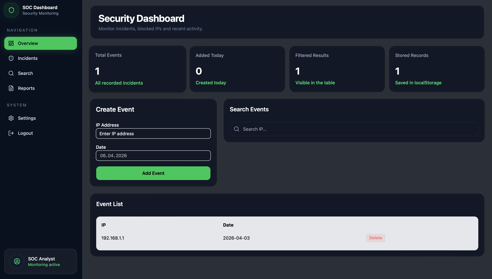

# 🚀 SOC Dashboard

This project is a simple SOC (Security Operations Center) dashboard that allows users to manage and monitor IP blocklist entries.

Users can add IP addresses, track when they were added, search through existing records, and remove entries. The application persists data locally using the browser's localStorage.

---

## ✨ Features

* ➕ Add IP address with date
* 🔍 Search IP addresses (case-insensitive)
* ❌ Delete IP entries
* 🚫 Prevent duplicate IP entries
* 💾 Data persistence using localStorage
* ⚡ Real-time UI updates

---

## 🛠️ Technologies Used

* React (Vite)
* TypeScript
* TailwindCSS
* React Hook Form
* Zod (for validation)
* shadcn/ui (UI components)

---

## 🧠 Key Concepts Practiced

* Component-based architecture
* State management with `useState`
* Side effects with `useEffect`
* Memoization with `useMemo`
* Form handling with `react-hook-form`
* Schema validation with Zod
* Separation of concerns (UI vs business logic)

---

## 📂 Project Structure

```bash
src/
  components/
    dashboard/
      DashboardHeader.tsx
      EventForm.tsx
      EventTable.tsx
      SearchBar.tsx
      Sidebar.tsx
    ui/
      Button.tsx
      Input.tsx
      Card.tsx
      Table.tsx
  lib/
    validators/
      event-schema.ts
    utils.ts
  types/
    event.ts
  App.tsx
  main.tsx
```

---

## ⚙️ Installation

```bash
# Clone the repository
git clone https://github.com/elifnurcakici/soc-dashboard.git

# Navigate into the project
cd soc-dashboard

# Install dependencies
npm install

# Start the development server
npm run dev
```

---

## 🔐 Validation Logic

* IP address format is validated using Zod schema
* Duplicate IP entries are prevented at the application level
* Errors are displayed directly in the form UI

---

## 💡 Notes

* Data is stored in localStorage, so it persists across page reloads
* No backend is used in this project (frontend-focused implementation)

---

## 📸 Preview


## 👩🏻‍💻 Author

**Elif Çakıcı**

* GitHub: https://github.com/elifnurcakici

---

## ⭐️ Show Your Support

If you like this project, consider giving it a ⭐️ on GitHub!
